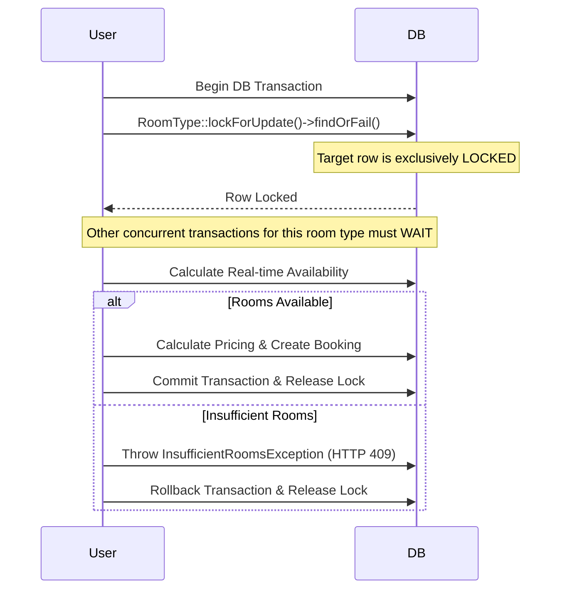

# 🏨 Mini Hotel Booking API


A robust, production-ready RESTful API for a mini hotel booking system. This project is built to demonstrate senior-level backend engineering practices, focusing on **data integrity, scalability, clean architecture, and real-world concurrency handling.**

---

## ✨ System Architecture & Key Features

This API was engineered moving beyond basic CRUD operations, implementing advanced design patterns to solve real-world problems:

*   **🛡️ Concurrency & Overbooking Prevention**: Utilizes **Pessimistic Locking** (`lockForUpdate`) wrapped in database transactions to absolutely guarantee that high-concurrency booking attempts on the last available room will never result in overbooking.
*   **🧩 Strategy Pattern (Pricing Engine)**: Pricing logic is decoupled from controllers and services using the Strategy Pattern. Rules (like Weekend Surcharges and Long-Stay Discounts) are injected via Dependency Injection, making the system highly extensible.
*   **🏛️ Service Layer & DTOs**: Controllers are kept incredibly lean. Complex business logic lives entirely in dedicated, interface-bound Service classes. Data parsing validation is strictly mapped to immutable **DTOs (Data Transfer Objects)**.
*   **🚦 Robust Authorization & Validation**: 
    *   Strict Cross-field validation (e.g., verifying a selected room type genuinely belongs to the selected hotel).
    *   Laravel Policies (`BookingPolicy`) enforce strict data isolation between users.
    *   Separate public (read-only) and admin (write-protected) routing architectures.
*   **🚀 Performance Optimizations**: 
    *   **Redis Caching**: Heavy read endpoints (like fetching available hotels) are aggressively cached using Redis with automated cache-invalidation hooks on writes.
    *   **Asynchronous Queues**: Post-booking confirmation processes (like sending emails) are offloaded to background jobs, ensuring sub-second API response times.

---

## ⚙️ Setup & Installation

The project is fully Dockerized natively, ensuring a robust environment that perfectly mimics production.

### Prerequisites
*   Docker & Docker Compose installed.
*   Composer (optional, for local vendor installation).

### Installation Steps

1.  **Clone the repository:**
    ```bash
    git clone https://github.com/EsraaEissa123/mini-hotel-booking-api.git
    
    cd mini-hotel-booking-api
    ```

2.  **Environment Setup:**
    ```bash
    cp .env.example .env
    ```

3.  **Build & Start Docker Containers:**
    ```bash
    docker-compose up -d --build
    ```

4.  **Install PHP Dependencies & Setup App:**
    ```bash
    docker-compose exec app composer install
    docker-compose exec app php artisan key:generate
    docker-compose exec app php artisan migrate --seed
    ```
    *(Seeding generates a rich dataset: 4 hotels globally, complete with varied room types, capacities, and a default test user `test@example.com` / `password`).*

---

## 🔒 Overbooking Prevention (Technical Deep Dive)

To ensure data consistency in high-concurrency environments, we bypass unreliable application-level checks and enforce **Pessimistic Locking** directly at the database engine level.



---

## 📖 API Documentation & Endpoints

A complete, fully nested **Postman Collection** is included in the repository root: `Mini_Hotel_Booking_API_Postman_Collection.json`. Import this into Postman for instant access to all requests, headers, and payloads.

### Authentication & Public Routes
| Method | Endpoint | Description | Auth Required |
| :--- | :--- | :--- | :---: |
| `POST` | `/api/auth/register` | Register a new guest user | ❌ |
| `POST` | `/api/auth/login` | Authenticate & retrieve Bearer Token | ❌ |
| `GET` | `/api/availability` | Search available rooms by city, dates, & occupancy | ❌ |
| `GET` | `/api/hotels` | List all active hotels (Paginated & Cached) | ❌ |
| `GET` | `/api/hotels/{hotel}/room-types` | View room types for a specific hotel | ❌ |

### Guest Operations 
| Method | Endpoint | Description | Auth Required |
| :--- | :--- | :--- | :---: |
| `POST` | `/api/bookings` | Create a new hotel booking | 🔐 Valid User |
| `GET` | `/api/bookings` | View user's booking history | 🔐 Valid User |
| `GET` | `/api/bookings/{booking}` | Get details of a specific booking | 🔐 Booking Owner |
| `PATCH`| `/api/bookings/{booking}/cancel` | Cancel an active booking | 🔐 Booking Owner |

### Admin Operations 
| Method | Endpoint | Description | Auth Required |
| :--- | :--- | :--- | :---: |
| `POST` | `/api/hotels` | Create a new hotel | 🔐 Admin/Staff |
| `PUT` | `/api/hotels/{hotel}` | Update hotel details | 🔐 Admin/Staff |
| `DELETE` | `/api/hotels/{hotel}` | Safely soft-delete a hotel | 🔐 Admin/Staff |

---

## 🧪 Testing Suite

The application features a comprehensive, robust autonomous test suite covering Feature integration, Unit logic, Edge cases, API Authentication, and graceful failure handling.

To execute the test suite:
```bash
docker-compose exec app php artisan test
```

**Test Coverage Highlights:**
- ✅ Validates Pricing Engine accuracy (including discounts & surcharges).
- ✅ Tests explicit concurrency scenarios (overlapping bookings).
- ✅ Protects against Authorization tampering (Users attempting to access extraneous bookings).
- ✅ Validates complex database isolation logic.

---

## 💡 Assumptions Made During Development
1. **Dynamic Nightly Pricing**: Pricing is defined uniquely per room type, but the final total is calculated dynamically based on stay dates and injected pricing rules.
2. **Global Timezone Normalization**: All check-in and check-out dates are strictly handled using standard boundary intervals `(00:00:00)` to eliminate creeping timezone miscalculations.
3. **Availability Real-time Matrix**: System availability deliberately avoids fragile cron-based or pre-calculated cache tables; it calculates dynamically at query-time enforcing absolute certainty checking against overlapping confirmed bookings.
