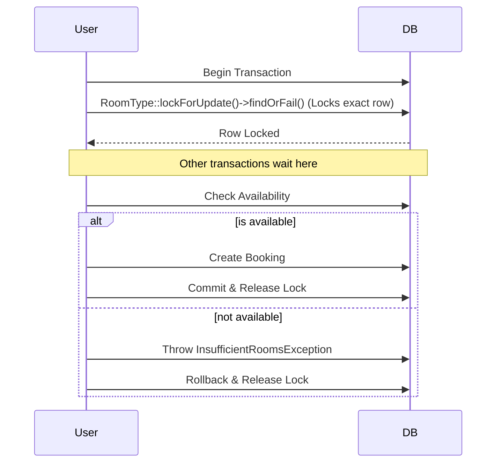

# Mini Hotel Booking API

A RESTful Hotel Booking API built with Laravel 11, PHP 8.2+, and MySQL.

## Project Description
This API provides a streamlined experience for managing hotel bookings, specifically designed to demonstrate robust business logic, overbooking prevention, and dynamic pricing strategies.

## Setup Instructions

1. **Clone the repository and install dependencies:**
   ```bash
   composer install
   ```

2. **Configure your environment setup:**
   ```bash
   cp .env.example .env
   php artisan key:generate
   ```
   **Note**: Update your `.env` with your desired MySQL Database credentials (`DB_DATABASE`, `DB_USERNAME`, `DB_PASSWORD`).

3. **Run database migrations and seed data:**
   ```bash
   php artisan migrate --seed
   ```
   (Seed data includes a test user `test@example.com` / `password` and multiple fake hotels).

4. **Serve the application:**
   ```bash
   php artisan serve
   ```

## Overbooking Prevention

To ensure data consistency and prevent overbooking in high-concurrency environments, we implement **Pessimistic Locking**.



When a booking request is initiated, the application:
1. Starts a database transaction.
2. Uses `lockForUpdate()` on the specific `room_type` row. This ensures any concurrent requests for the same room type must wait until the current transaction is finished.
3. Calculates real-time availability *inside* the lock.
4. Completes the booking or throws an error (409 Conflict).
5. Commits the transaction, releasing the lock.

## Pricing Logic

Our system uses a dynamic nightly pricing strategy:
- **Base Price**: Defined at the `RoomType` level.
- **Weekend Surcharge**: +20% for nights falling on Friday or Saturday.
- **Long-Stay Discount**: -10% on the *total sum* for bookings of 5 nights or more.
- Calculated per room and then multiplied by the number of requested rooms.

**Example Calculation:**
Base price $100 for 5 nights (Mon-Fri)
- Mon: $100
- Tue: $100
- Wed: $100
- Thu: $100
- Fri: $120 (+20%)
- Subtotal: $520
- Long Stay (>= 5 days): -10% discount ($52)
- Total: $468

## API Endpoints

| Method | Endpoint | Description | Auth Required |
| --- | --- | --- | --- |
| `POST` | `/api/auth/register` | Register new user | No |
| `POST` | `/api/auth/login` | Login and get token | No |
| `POST` | `/api/auth/logout` | Logout (destroy token) | Yes |
| `GET` | `/api/hotels` | List hotels | No |
| `GET` | `/api/hotels/{hotel}` | Get single hotel details | No |
| `GET` | `/api/hotels/{hotel}/room-types` | List hotel room types | No |
| `GET` | `/api/hotels/{hotel}/room-types/{room_type}` | Get single room type details | No |
| `GET` | `/api/availability` | Search for available rooms | No |
| `GET` | `/api/bookings` | View user's bookings | Yes |
| `POST` | `/api/bookings` | Create a booking | Yes |
| `GET` | `/api/bookings/{booking}` | Get a single booking details | Yes |
| `PATCH`| `/api/bookings/{booking}/cancel` | Cancel an existing booking | Yes |

### Request / Response Examples

#### 1. Availability Search (`GET /api/availability`)
**Query Parameters:**
`city=Cairo&check_in=2026-05-01&check_out=2026-05-05&adults=2`

**Response (200 OK):**
```json
{
  "data": [
    {
      "hotel": { "id": 1, "name": "Grand Cairo Resort", "city": "Cairo", "address": "123 Nile Corniche", "rating": 5 },
      "room_type": { "id": 2, "name": "Double", "max_occupancy": 2, "base_price": 150 },
      "available_rooms": 15,
      "nights": 4,
      "total_price": 600.00
    }
  ]
}
```

#### 2. Create Booking (`POST /api/bookings`)
**Payload:**
```json
{
  "hotel_id": 1,
  "room_type_id": 2,
  "guest_name": "John Doe",
  "guest_email": "john@example.com",
  "check_in": "2026-05-01",
  "check_out": "2026-05-05",
  "rooms_count": 1,
  "adults_count": 2
}
```

**Response (201 Created):**
```json
{
  "data": {
    "id": 1,
    "hotel": { "id": 1, "name": "Grand Cairo Resort", "city": "Cairo", "address": "123 Nile Corniche", "rating": 5 },
    "room_type": { "id": 2, "name": "Double", "max_occupancy": 2, "base_price": 150 },
    "guest_name": "John Doe",
        "guest_email": "john@example.com",
        "check_in": "2026-05-01",
        "check_out": "2026-05-05",
        "rooms_count": 1,
        "adults_count": 2,
        "total_price": 600.00,
        "status": "pending",
        "created_at": "2026-04-06T00:00:00+00:00"
  }
}
```

## Assumptions Made
1. **Dynamic Room Pricing**: Pricing is fixed per room type but calculated dynamically based on dates.
2. **Global Timezone**: All dates are handled exactly based on boundaries to avoid timezone issues.
3. **Availability Real-time Check**: Availability is strictly calculated exactly upon inquiry, leveraging actual bookings rather than caching available slots per day manually.
4. **User Scope**: Users will be constrained strictly to see and manage only their respective bookings directly.
